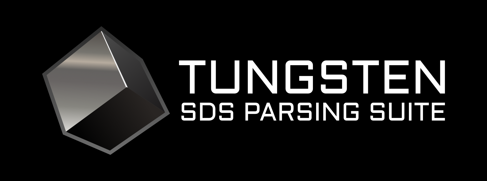

<div align="center">
    <a align="center" href="https://pypi.org/project/tungsten-sds/">
        
    </a>
    <h1 align="center">Tungsten</h1>
    <p align="center">A material safety data sheet parser.</p>
</div>

## Installation
Tungsten is available on PyPi via pip. To install, run the following command:
```sh
pip install tungsten-sds
```

## Usage Example
```python
from pathlib import Path

from tungsten import SigmaAldrichSdsParser

sds_parser = SigmaAldrichSdsParser()
sds_path = Path("sigma_aldrich_w4502.pdf")

# Convert PDF file to parsed data
with open(sds_path, "rb") as f:
    sds = sds_parser.parse_to_ghs_sds(f, sds_name=sds_path.stem)

# Serialize parsed data to JSON and dump to a file
with open(sds_path.stem + ".json", "w") as f:
    sds.dump(f)
```

## License
This work is licensed under MIT. Media assets in the `assets` directory are licensed under a
Creative Commons Attribution-NoDerivatives 4.0 International Public License.
